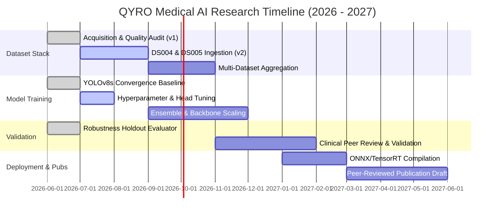

# QYRO Medical AI - Research & Development Roadmap

This document outlines the professional milestones, timeline, and research targets for the QYRO Acne model series and general dermatological AI development.

---

## 🗺️ Project Milestones

---

## 🎯 Detailed Milestone Breakdown

### Milestone 1: Dataset Acquisition & Quality Curation (Phase 1)
* **Goal:** Standardize and clean five public/academic acne datasets.
* **Deliverables:**
  * ✅ Standardized dataset manifests and registries.
  * ✅ Automated image quality checkers (blur, brightness, size constraints).
  * ✅ Deduplication pipeline (MD5 and dHash) resulting in **0.0% cross-split leakage**.
* **Status:** **Completed** (Phase 6B).

### Milestone 2: Baseline Model & Convergence Stabilization
* **Goal:** Establish target baseline training runs for object detection, subtype classification, and severity grading.
* **Deliverables:**
  * ✅ YOLOv8n detection baseline and YOLOv8s convergence recovery run.
  * ✅ Attained target success metrics (**mAP50 = 0.694 > 0.68**, **Precision = 0.686 > 0.65**).
  * ✅ EfficientNet-B0 subtype classification and ordinal severity grading baseline runs.
* **Status:** **Completed** (Phase 7D.3).

### Milestone 3: Annotation Refinement & Crowd Calibration (Q3 2026)
* **Goal:** Reconcile annotation crowding in dense lesion clusters to break the recall bottleneck.
* **Deliverables:**
  * ⬜ Automated crowd-density detection mapping.
  * ⬜ NMS IoU threshold calibration sweeps (optimal deployment range `0.55–0.65`).
  * ⬜ Clinical active-learning loop for identifying and correcting mislabeled boundaries.
* **Status:** **In Progress**.

### Milestone 4: Multi-Dataset Training & Ensemble Modelling (Q4 2026)
* **Goal:** Ingest next-tier datasets and train high-capacity ensemble networks.
* **Deliverables:**
  * ⬜ Process and integrate **DS004 (ACNE04 v2)** and **DS005 (SCIN/Fitzpatrick expansion)**.
  * ⬜ Train unified detector backbones on the aggregated data pool.
  * ⬜ Develop ensemble heads (combining YOLOv8s detectors with EfficientNet classification crops).
* **Status:** **Planned**.

### Milestone 5: Clinical Collaboration & External Validation (Q1 2027)
* **Goal:** Conduct external, blind evaluations with academic medical centers and clinics.
* **Deliverables:**
  * ⬜ Partner with 3+ clinical research centers for prospective dataset acquisitions.
  * ⬜ Run out-of-distribution blind audits on diverse demographic cohorts.
  * ⬜ Benchmark clinical safety metrics (false positive texture reject rate vs dermatologist consensus).
* **Status:** **Planned**.

### Milestone 6: Production API & Device Portability (Q2 2027)
* **Goal:** Prepare models for production deployment and cross-device scaling.
* **Deliverables:**
  * ⬜ Optimize models for TensorRT and CoreML execution.
  * ⬜ Release a production-grade inference API with strict HIPAA/GDPR data-privacy containment.
  * ⬜ Develop micro-inference pipelines for smartphone camera lenses.
* **Status:** **Planned**.

### Milestone 7: Medical Publication & Documentation Release (Q3 2027)
* **Goal:** Publish clinical findings and model benchmarks.
* **Deliverables:**
  * ⬜ Submit research paper detailing the QYRO multi-stage detection pipeline to peer-reviewed journals (e.g., *Journal of Investigative Dermatology* or *MICCAI*).
  * ⬜ Release the unified benchmark evaluation results on the SCIN and DermNet reference atlases.
* **Status:** **Planned**.
