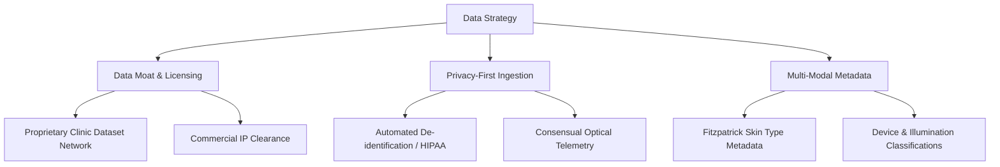

# QYRO Dataset Collection & Research Strategy

This document outlines the dataset collection and sourcing strategy for the QYRO Medical AI Research System. As we transition from the QYRO-Acne prototype into a multi-condition, production-grade clinical AI platform, establishing a methodical, reproducible, and compliant data ingestion pipeline is critical.

---

## 1. Why Phased Dataset Collection is Used

Medical computer vision systems require high specificity, sensitivity, and generalization across diverse patient populations. Attempting to ingest, clean, and annotate datasets for all 20+ targeted skin and hair conditions simultaneously creates several operational risks:
- **Resource Dilution:** Cleaning and validating medical images requires significant expert input. Ingesting too many conditions at once dilutes domain-specific quality control.
- **Annotation Bottlenecks:** Clinical labeling (e.g., segmenting lesions, grading severity) is a high-cost process. A phased approach ensures annotation pipelines are calibrated and verified per condition before scaling.
- **Pipeline Evolution:** We expect our deduplication, image quality checks, and metadata extraction scripts to evolve. A phased rollout allows us to refine these tools on early-phase conditions (e.g., acne) before applying them to others.

---

## 2. Why Free & Public Datasets First

Our initial research phase leverages open-access and public academic datasets (e.g., Fitzpatrick17k, ISIC, HAM10000, DermNet).
- **Zero Ingestion Cost:** Allows us to build and stress-test our data-cleaning, deduplication, and quality-check pipelines without upfront capital expenditure.
- **Benchmark Establishment:** Public datasets serve as baseline benchmarks. They allow us to establish initial classification accuracy and compare our models with existing peer-reviewed literature.
- **Standardized Labels:** Academic datasets often ship with standardized tagging (e.g., Fitzpatrick skin typing, biopsy-confirmed ground truths) which helps in bootstrapping annotation models.

---

## 3. Why Paid & Commercial Datasets Later

While public datasets are valuable for initial exploration, they have key limitations that commercial datasets resolve.
- **Licensing Compliance:** Many free datasets carry restrictive non-commercial licenses (e.g., CC BY-NC). Commercial deployment of QYRO models requires clean IP chains, which paid datasets provide.
- **Demographic & Device Representation:** Public research datasets are heavily biased toward specific Fitzpatrick skin types and clinical settings (mostly high-end dermatoscopes). Paid datasets allow us to target and acquire specific demographics, camera types, and lighting conditions.
- **Data Curation & High Resolution:** Commercial vendors provide high-resolution, expert-vetted clinical images with comprehensive metadata (patient age, sex, anatomic site, and comorbidities), reducing clean-up overhead.

---

## 4. Why Clinic-Supervised Images Matter

The ultimate competitive moat and clinical validation for QYRO will stem from clinic-collected, practitioner-supervised datasets.
- **True Operational Domain:** In-the-wild consumer images contain noise (poor lighting, out-of-focus, background clutter, compression artifacts). Clinic-collected images represent the transition point between controlled medical photography and consumer-grade telemetry.
- **Verified Ground Truth:** Web-scraped datasets are notoriously noisy, with mislabeled images. Clinic images come with direct dermatologist-supervised diagnosis (often confirmed via biopsy, response to treatment, or consensus panels).
- **Continuous Active Learning:** Establishing direct telemetry loops with clinics allows QYRO to identify edge cases, collect low-confidence samples, and feed them back into the annotation and retraining loop (active learning).

---

## 5. Why Acne is the First Condition

Acne Vulgaris is designated as Phase 1 of the QYRO Research Workspace for several strategic reasons:
- **Prototype Continuity:** Leverage domain knowledge, initial cleaning parameters, and insights gained during the development of the QYRO-Acne prototype.
- **High Prevalence & Data Abundance:** Acne is one of the most common dermatological complaints globally. This translates to an abundant supply of public, commercial, and clinic-supervised images.
- **Grading Standardization:** Acne severity is backed by well-established clinical grading scales (e.g., Global Acne Grading System (GAGS), Investigator's Global Assessment (IGA)), making structured annotation and model validation highly objective.

---

## 6. Long-Term QYRO Data Strategy

Our long-term data strategy is built on three pillars to ensure QYRO's clinical viability and IP value:

### Pillar A: Proprietary Data Moat & Licensing
We will continually expand our network of partner clinics to ingest unique, high-fidelity clinical images under strict institutional agreements. Every dataset used in production models will have verifiable chain-of-custody documentation and commercial clearance.

### Pillar B: Privacy-First Ingestion (HIPAA/GDPR Compliance)
All clinic-collected images must pass through an automated de-identification pipeline at ingestion. This includes:
- Face/background blurring or masking.
- Stripping of EXIF headers containing GPS or device identifiers.
- Anonymization of clinical metadata records, linking them only to randomized internal identifiers.

### Pillar C: Multi-Modal Metadata Integration
Rather than training models on raw pixels alone, QYRO will capture structured patient metadata (age, gender, ethnicity, self-reported symptoms, skin type, duration). Combining image features with structured metadata significantly boosts clinical diagnostic accuracy and robustness.
