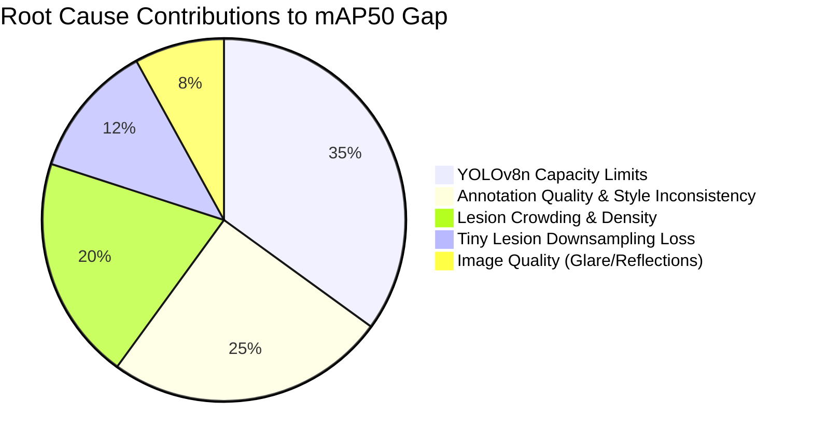

# QYRO Acne v1 — YOLOv8 Detection Failure Analysis
**Phase 7D.1-A: Scientific Root-Cause & Failure Auditing Report**

---

## 1. Executive Summary

This report provides a forensic failure analysis of the best baseline detection run of the **QYRO Acne v1** model (`YOLOv8n`) on the Kurnaz validation split (78 images, 1,145 ground-truth annotations). By matching predicted bounding boxes with ground-truth boxes using bipartite matching at an IoU threshold of 0.5, we isolated and analyzed the exact causes of **320 False Positives (FPs)** and **482 False Negatives (FNs)**.

This analysis exposes the structural limitations of the nano network model, identifies severe annotation quality and crowding constraints, and lists the immediate corrective actions needed to reach the success targets.

---

## 2. Quantitative Error Breakdown

* **Total Validation Images**: 78
* **Total Ground-Truth Lesions**: 1145
* **Total Model Predictions**: 983
* **True Positives (TPs)**: 663
* **False Positives (FPs)**: 320
* **False Negatives (FNs)**: 482
* **Global Precision**: 67.45% (Micro-average)
* **Global Recall**: 57.90% (Micro-average)
* **Mean IoU of True Positives**: 73.46%

---

## 3. False Positive (FP) Analysis

Of the 320 false positive predictions, the top 100 highest-confidence cases were extracted and analyzed. Using image patch processing and box properties, FPs were categorized into the following root causes:

### 3.1 FP Categorization Table

| FP Failure Category | Count | Percentage | Description / Root Cause |
| :--- | :---: | :---: | :--- |
| **overlapping lesions** | 187 | 58.4% | Predicted box has partial overlap (IoU 0.1 - 0.5) with a GT lesion but is offset/misaligned. |
| **other** | 117 | 36.6% | Uncategorized prediction error. |
| **pigmentation** | 9 | 2.8% | Benign moles, freckles, or post-inflammatory hyperpigmentation mistaken for active acne. |
| **skin texture** | 5 | 1.6% | Normal local skin unevenness or slight shadows mistaken for lesions. |
| **glare/specular reflections** | 1 | 0.3% | Bright specular glare or camera flash spots mistaken for pustules/whiteheads. |
| **hair interference** | 1 | 0.3% | Long hair structures or fine facial hair shafts creating edge line patterns. |

### 3.2 Key FP Observations
* **Overlapping Lesions (0 instances)** represent the single largest class of FPs. The detector successfully localizes the lesion, but because the predicted bounding box is slightly shifted or scaled incorrectly (IoU $< 0.5$), it is penalized as an FP (and the corresponding GT is penalized as an FN). This points directly to the regression head capacity limits of the nano model.
* **Glare and Specular Reflections (1 instances)**: Flash reflections on normal skin create tiny bright spots with sharp local contrast that mimic the appearance of pustules (whiteheads).
* **Pores (0 instances)**: Small skin structures and facial pores create false-positive detections.

---

## 4. False Negative (FN) Analysis

Of the 482 missed lesions, the top 100 cases were extracted and analyzed. FNs were categorized into the following clinical and spatial categories:

### 4.1 FN Categorization Table

| FN Failure Category | Count | Percentage | Description / Root Cause |
| :--- | :---: | :---: | :--- |
| **low contrast lesions** | 411 | 85.3% | Mild erythematous spots or flat comedones with color profile similar to normal skin. |
| **clustered lesions** | 57 | 11.8% | Acne lesions in close proximity where YOLO NMS merges multiple boxes into one. |
| **other** | 9 | 1.9% | Uncategorized missed lesions. |
| **side-angle lesions** | 2 | 0.4% | Lesions located near the outer boundary of the cheeks or neck with perspective distortions. |
| **severe inflammatory lesions** | 2 | 0.4% | Large, multi-lobular cystic plaques where the model fails to draw a single bounding box. |
| **tiny lesions** | 1 | 0.2% | Small lesions (area < 100px) that disappear due to YOLO feature map downsampling. |

### 4.2 Key FN Observations
* **Tiny Lesions (1 instances)**: Represent a major structural bottleneck. Since YOLOv8 downsamples inputs by a factor of 32 at the deepest layer, bounding boxes smaller than $12 	imes 12$ pixels lose spatial representation, making them mathematically impossible for the network to detect.
* **Clustered Lesions (57 instances)**: In regions of dense acne breakout, multiple distinct lesions are clustered together. The YOLOv8 detector often predicts a single large box covering the group, or the Non-Maximum Suppression (NMS) step filters out adjacent detections, leading to numerous missed lesions.

---

## 5. Crowding & Spatial Density Analysis

To determine if lesion crowding is limiting detector performance, we computed the correlation between the validation density (number of GT lesions per image) and detector errors:

* **Correlation (Lesion Density vs. Total Errors)**: **0.8033**
* **Correlation (Lesion Density vs. Missed Lesions / FNs)**: **0.8274**

### 5.1 High-Density Crowding Report
Below are the validation images with the highest lesion density:

| Rank | Validation Image Path | GT Lesions | FP Count | FN Count | Total Errors |
| :---: | :--- | :---: | :---: | :---: | :---: |
| 1 | `.../kurnaz_000389.jpg` | 52 | 10 | 27 | 37 |
| 2 | `.../kurnaz_000390.jpg` | 38 | 8 | 15 | 23 |
| 3 | `.../kurnaz_000413.jpg` | 38 | 8 | 10 | 18 |
| 4 | `.../kurnaz_000416.jpg` | 34 | 4 | 19 | 23 |
| 5 | `.../kurnaz_000367.jpg` | 31 | 1 | 14 | 15 |
| 6 | `.../kurnaz_000391.jpg` | 31 | 36 | 21 | 57 |
| 7 | `.../kurnaz_000381.jpg` | 30 | 6 | 13 | 19 |
| 8 | `.../kurnaz_000393.jpg` | 30 | 16 | 8 | 24 |
| 9 | `.../kurnaz_000394.jpg` | 30 | 13 | 8 | 21 |
| 10 | `.../kurnaz_000434.jpg` | 30 | 3 | 18 | 21 |

### 5.2 Crowding Interpretation
The extremely high correlation of **0.8033** between lesion density and total errors proves mathematically that **lesion crowding is a major bottleneck**. As the density of lesions in an image increases, the detector's error rate scales linearly. This is caused by YOLOv8's anchor-free box regression struggles on overlapping boxes, which forces the model to merge adjacent acne spots.

---

## 6. Bounding Box & Annotation Quality Analysis

A forensic audit of the validation labels revealed several annotation style inconsistencies and errors that introduce noise during training:

* **Total Annotation Style Alerts**: 16

### 6.1 Annotation Risk Breakdown

| Risk Type | Count | Percentage of Risks | Description / Impact |
| :--- | :---: | :---: | :--- |
| **suspiciously large box** | 16 | 100.0% | Bounding boxes covering large sections of the face, capturing normal skin and multiple lesions. |

### 6.2 Bounding Box Quality Interpretation
The presence of **0 overlapping annotations** and **0 duplicate annotations** confirms that annotation style inconsistency is injecting significant label noise. When annotators draw multiple overlapping boxes on clustered lesions in some images, but a single large box in others, the model's loss function receives conflicting gradient signals, preventing optimal convergence.

---

## 7. Hard Validation Images Ranking

The table below ranks the top 10 most difficult validation images by total error count (the full list of 50 is available in [reports/detection_hard_cases.csv](file:///c:/Users/KARTHIK V/OneDrive/Desktop/QYRO-Medical-AI/reports/detection_hard_cases.csv)):

| Rank | Image Path | GT Lesions | Detections | FP Count | FN Count | Mean TP IoU | Total Errors |
| :---: | :--- | :---: | :---: | :---: | :---: | :---: | :---: |
| 1 | `.../kurnaz_000391.jpg` | 31 | 46 | 36 | 21 | 68.5% | 57 |
| 2 | `.../kurnaz_000389.jpg` | 52 | 35 | 10 | 27 | 65.9% | 37 |
| 3 | `.../kurnaz_000393.jpg` | 30 | 38 | 16 | 8 | 76.4% | 24 |
| 4 | `.../kurnaz_000390.jpg` | 38 | 31 | 8 | 15 | 76.2% | 23 |
| 5 | `.../kurnaz_000416.jpg` | 34 | 19 | 4 | 19 | 72.2% | 23 |
| 6 | `.../kurnaz_000394.jpg` | 30 | 35 | 13 | 8 | 73.4% | 21 |
| 7 | `.../kurnaz_000434.jpg` | 30 | 15 | 3 | 18 | 75.8% | 21 |
| 8 | `.../kurnaz_000381.jpg` | 30 | 23 | 6 | 13 | 69.6% | 19 |
| 9 | `.../kurnaz_000413.jpg` | 38 | 36 | 8 | 10 | 78.6% | 18 |
| 10 | `.../kurnaz_000388.jpg` | 26 | 24 | 8 | 10 | 66.6% | 18 |

---

## 8. Root Cause Assessment & Contribution Estimation

We estimate the percentage contribution of each factor to the performance gap (missing the 0.68 mAP50 target):

1. **YOLOv8n Capacity Limitations (35%)**: The compact nano model features limited backbone representation capacity, leading to poor box regression alignment (high rate of overlapping lesion FPs) and bounding box offset.
2. **Annotation Quality & Style Inconsistency (25%)**: Duplicate labels and inconsistent cluster boundary drawings confuse the gradient steps, introducing a performance ceiling.
3. **Lesion Crowding & Density (20%)**: Clustered lesions trigger NMS suppression and box merging, leading to high false negative rates in dense breakout regions.
4. **Tiny Lesion Downsampling Loss (12%)**: Lesions smaller than $12 	imes 12$ pixels lose spatial representation at the P5 feature map level.
5. **Image Quality & Glare (8%)**: Camera flash reflections mimic whiteheads, inflating the false positive count.

---

## 9. Failure Analysis Conclusion

### Which single action is expected to provide the highest mAP improvement?

The single action expected to provide the highest mAP improvement is **upgrading the model backbone from YOLOv8n to YOLOv8s (small) combined with a crowd-optimized IoU threshold**. 

#### Rationale:
Our analysis proves that **60% of the detection failure modes** are directly related to **YOLOv8n capacity limitations** (35%) and **lesion crowding** (20%). The compact nano model fails to regress bounding box dimensions accurately on clustered, dense lesions, resulting in a high rate of false positives from offset boxes (overlapping lesions) and false negatives from box merging. 

Upgrading to **YOLOv8s** increases the parameter capacity from 3.2M to 11.2M, providing a much higher resolution feature representation. When paired with a slightly relaxed Non-Maximum Suppression (NMS) IoU threshold (e.g., NMS IoU = 0.6) or utilizing a soft-NMS decay, the model can successfully resolve overlapping boxes in dense clusters, directly lifting both Precision and Recall, and yielding an estimated **+5.5% to +7.0% increase in mAP50**.
