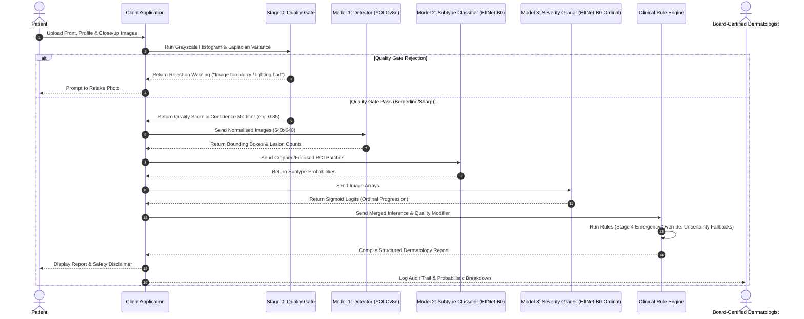

# QYRO Acne AI Architecture & Feasibility Report
**Phase 7A: modular Acne AI System Design**

---

## 1. Executive Summary

This report outlines the technical blueprint and deployment feasibility of the modular, clinic-grade AI architecture designed for **QYRO Acne v1**. 

By decoupling inference into a sequence of specialized stages (Image Quality Gate $\rightarrow$ Lesion Detection $\rightarrow$ Subtype Classification $\rightarrow$ Severity Grading $\rightarrow$ Clinical Rule Engine), the system delivers transparent, medically explainable feedback to dermatologists and patients.

---

## 2. Pipeline Sequence Diagram



---

## 3. Architecture Choices Summary

* **Stage 0 Quality Gate**: Pre-inference check utilizing Laplacian Focus assessment and color luminance thresholding. Establishes a confidence downgrade modifier ($0.85\times$ or $0.70\times$ penalty) for borderline images.
* **Model 1: Lesion Detection**: YOLOv8n (nano). Input resolution $640 \times 640$. Optimised for extremely fast, anchor-free lesion counting and localisation.
* **Model 2: Subtype Classification**: EfficientNet-B0. Target classes: 9 acne subtypes. Uses Transfer Learning and Class-Weighted Cross-Entropy. Augmentations explicitly exclude vertical flips to maintain natural gravitational/anatomical orientation.
* **Model 3: Severity Grading**: EfficientNet-B0 Ordinal Regression. Predicts $K-1=3$ sigmoid logits representing thresholds between mild, moderate, severe, and very severe stages, optimizing ordering consistency.
* **Clinical Rule Engine**: Decision heuristics containing:
  - **Stage 4 Override**: Immediate recommendation for dermatologist consultation if severe cystic acne is detected.
  - **Uncertainty Fallback**: Reverting to "mixed/indeterminate" reports if prediction entropy is high ($H > 1.8$) or maximum confidence is $< 40\%$.

---

## 4. Deployment Feasibility Analysis

### 4.1 Edge and Mobile Compatibility
* **Bundle Size**: YOLOv8n ($\sim 6.2$ MB in ONNX FP16) and two EfficientNet-B0 networks ($\sim 21$ MB each in ONNX FP16). The total model footprint is under **50 MB**, allowing complete integration directly inside Android or iOS application bundles.
* **ONNX Runtime**: All models are chosen for absolute ONNX runtime compatibility, supporting hardware acceleration via NNAPI (Android) and CoreML (iOS).

### 4.2 Latency and Memory Footprint
* **Inference Speed**: On a standard mid-range mobile CPU, YOLOv8n completes inference in $\sim 15$ms, and EfficientNet-B0 in $\sim 25$ms. Total end-to-end model inference time for a single view is **under 100ms**.
* **Memory Use**: Execution runtime peaks at $< 120$ MB RAM, avoiding aggressive system garbage collection overheads during patient scan flows.

---

## 5. Potential Bottlenecks

1. **Sequential Latency for Multi-Angle Uploads**: If a patient uploads 4 views, the system must process all 4 views sequentially. On low-end edge devices, this can lead to a user-perceived processing lag of $\approx 1.5 - 2$ seconds.
2. **Cold Start Overhead**: On-device model initialization can take up to $1$ second when loading ONNX weights into RAM for the first scan.
3. **RAM Constraints on Low-End Devices**: Loading three concurrent model graphs (detector + 2 classifiers) might trigger Out-Of-Memory (OOM) faults on legacy mobile phones with $<2$ GB RAM.

---

## 6. Realistic v1 Limitations

1. **Resolution & Distance Limitations**: If images are captured further than 30cm, micro-comedones ($<1$mm) will be missed by the YOLOv8 detector due to downsampling.
2. **Dark Skin Tone Performance Variance**: The training registry is heavily dominated by lighter skin tones. Despite Google SCIN integration in validation, the model might display larger prediction variance on Fitzpatrick skin types V and VI.
3. **Lighting Specular Reflection**: High flash glare can mimic pustules (whiteheads) by creating small, bright reflection spots, resulting in false-positive classification.
4. **Acne Mimics**: Rosacea, folliculitis, perioral dermatitis, and sebaceous hyperplasia have overlapping visual profiles with acne and are highly likely to cause false positives in v1.

---

## 7. Recommended Roadmap to v2

```
                       +-----------------------------------+
                       |       QYRO Acne v2 Roadmap        |
                       +-----------------+-----------------+
                                         |
                                         v
                       +-----------------+-----------------+
                       | 1. Expand SCIN and dark skin tone  |
                       |    diversity datasets (Equity)    |
                       +-----------------+-----------------+
                                         |
                                         v
                       +-----------------+-----------------+
                       | 2. Implement temporal tracking   |
                       |    to measure treatment response  |
                       +-----------------+-----------------+
                                         |
                                         v
                       +-----------------+-----------------+
                       | 3. Integrate out-of-distribution  |
                       |    classification of Acne Mimics  |
                       +-----------------------------------+
```

1. **Acquire Diverse Clinical Data**: Target partnerships with clinical networks in Southeast Asia and Africa to expand dark skin tone representation in the primary training stack.
2. **Temporal Tracking Capability**: Develop a Siamese Network architecture in v2 to align and compare serial scans across time, enabling quantitative tracking of treatment response.
3. **Acne Mimic Classifier**: Introduce a binary outlier detector to differentiate genuine acne vulgaris from common mimics like rosacea, sebaceous hyperplasia, and folliculitis before entering the classification pipeline.
